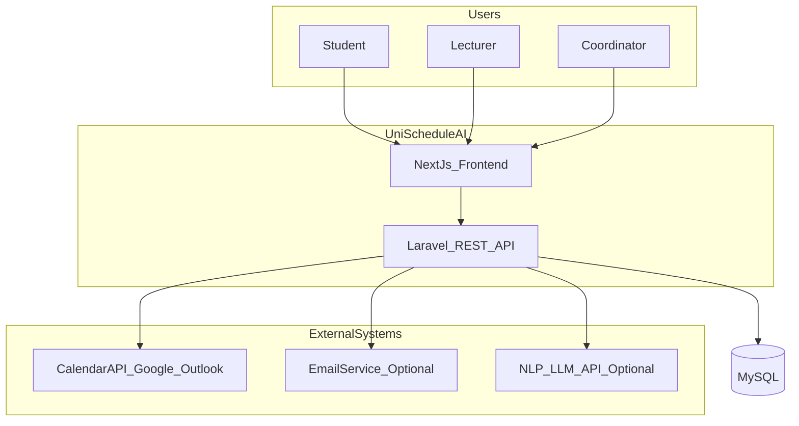
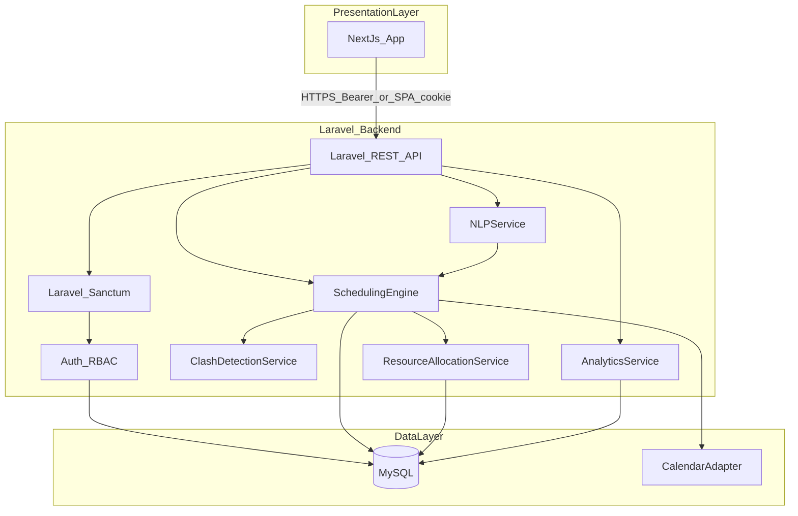
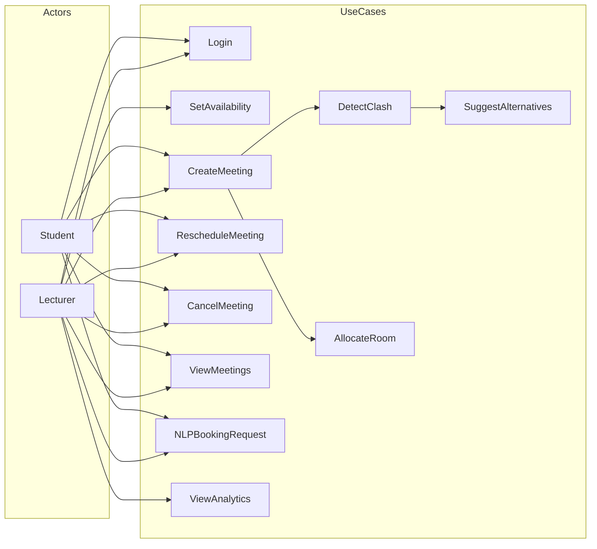
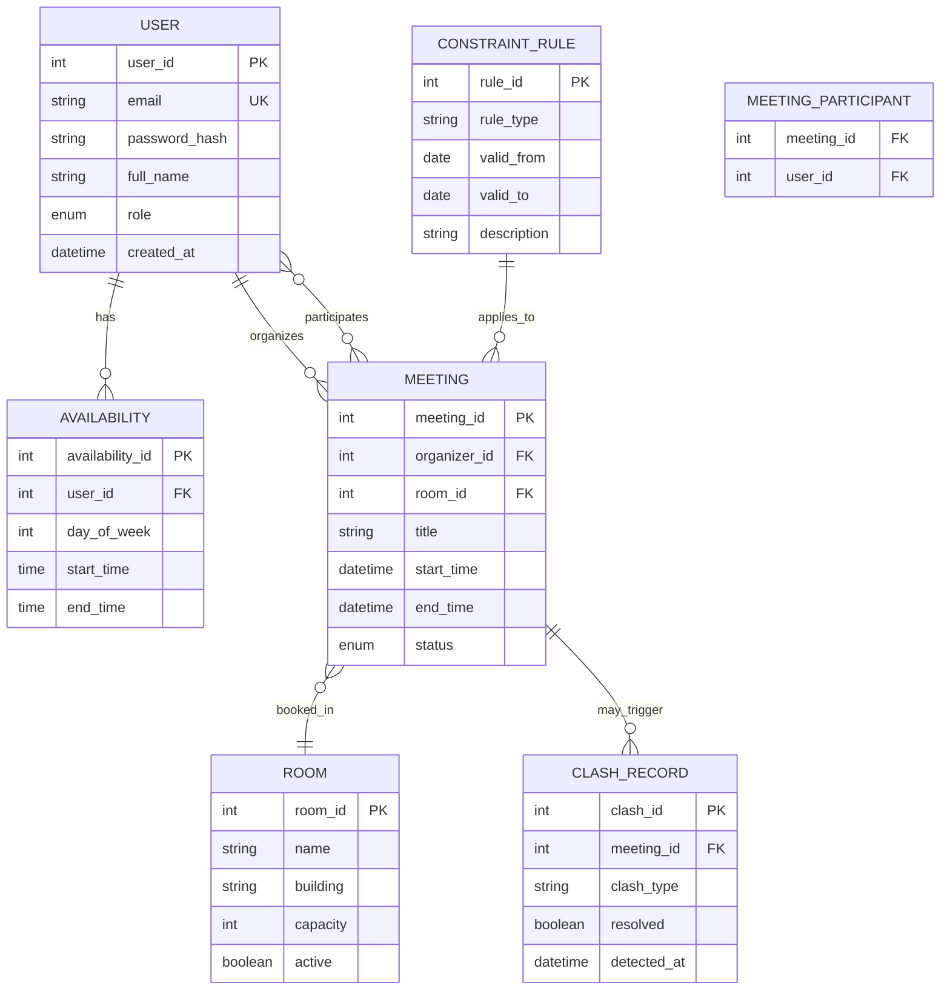
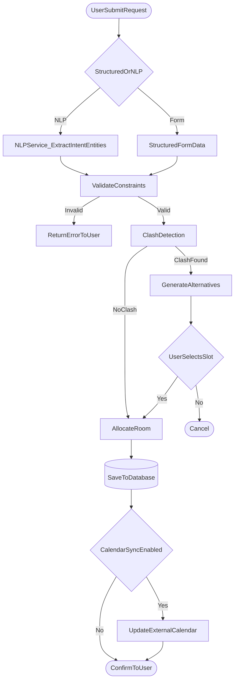
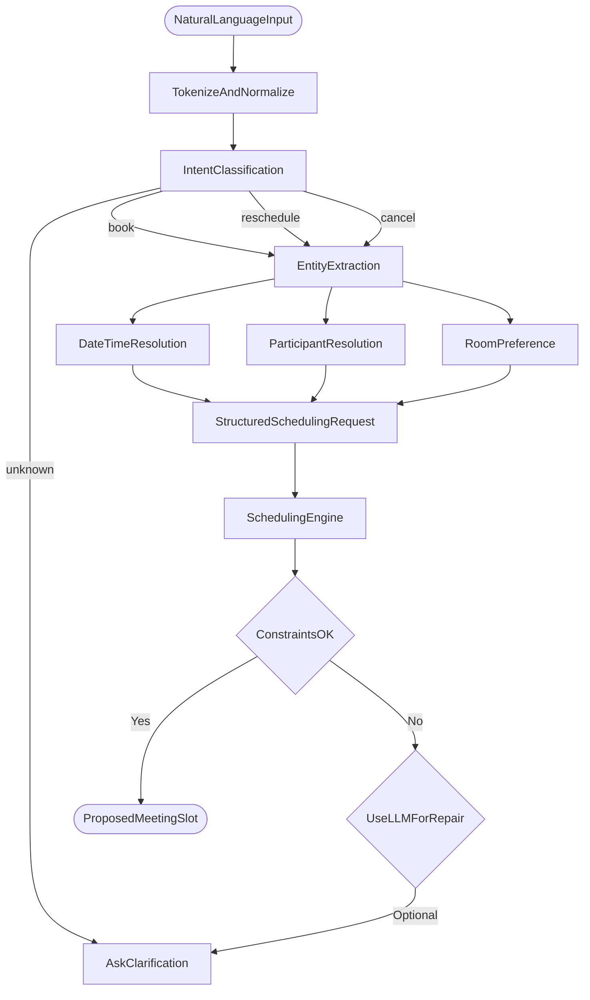
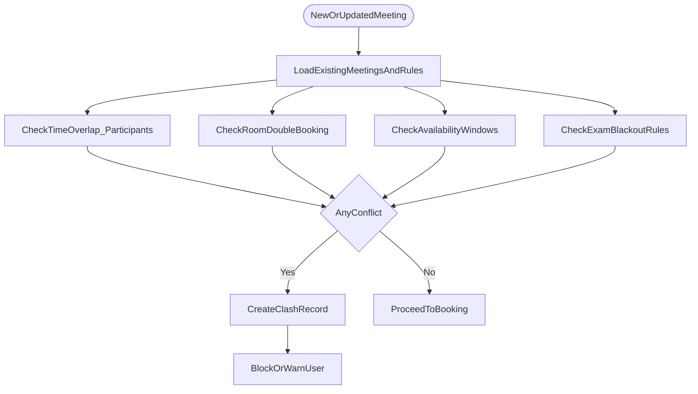
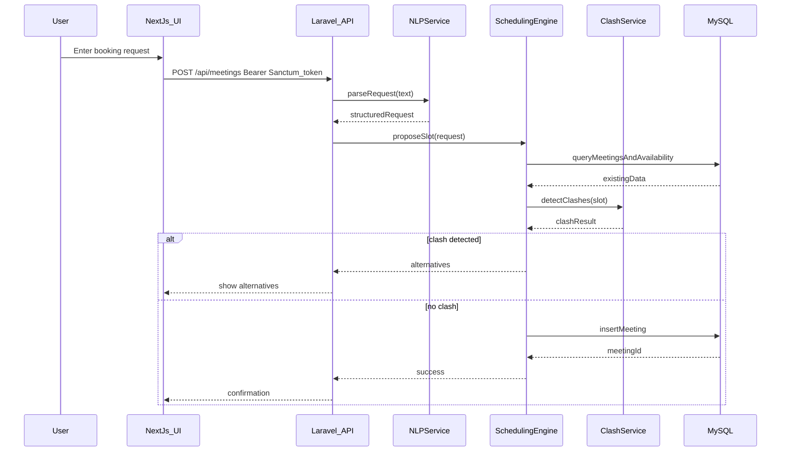
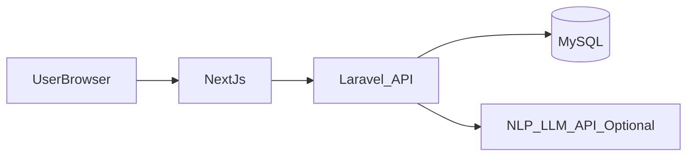

# UniSchedule AI — System Design Pack

**Student:** [Your Full Name] | **ID:** [Student ID] | **Date:** [Date]

This document contains all system design diagrams for supervisor review. Recreate polished versions in **draw.io** or **Lucidchart** for the final dissertation using the models below.

**Technology stack** (confirmed):

| Layer | Technology |
|-------|------------|
| Frontend | **Next.js** (React) + TypeScript |
| Backend | **Laravel** (PHP) — REST API |
| Database | **MySQL** |
| ORM / data access | Laravel Eloquent |
| Authentication | **Laravel Sanctum** (API tokens / SPA authentication) |
| NLP | LLM API or NLP service called from Laravel (HTTP); optional PHP NLP libraries |
| Diagrams | draw.io, Mermaid |

---

## 1. System context diagram

Shows UniSchedule AI in relation to users and external systems.

**Description:** Students and lecturers use the **Next.js** web application, which communicates with the **Laravel** REST API. Data is stored in **MySQL**. Laravel handles scheduling logic, Sanctum-protected routes, and optional calendar/NLP integrations.

---

## 2. High-level architecture diagram

**Description:** **Next.js** (presentation) calls **Laravel** REST endpoints protected by **Sanctum**. Laravel services implement scheduling, clash detection, resource allocation, and NLP integration. **Eloquent** maps entities to **MySQL**.

---

## 3. Use case diagram

**Description:** Core use cases cover authentication, meeting lifecycle, NLP requests, clash handling, and optional analytics for lecturers/coordinators.

---

## 4. Entity–Relationship diagram

**Description:** Users have availability slots and participate in meetings. Meetings are linked to rooms. Constraint rules encode exam periods and policies. Clash records audit detected conflicts.

---

## 5. Scheduling workflow

**Description:** Every booking passes constraint validation and clash detection before commit. Alternative slots are offered when conflicts occur.

---

## 6. AI / NLP decision flow

**Description:** Hybrid AI uses NLP/LLM for interpretation; the scheduling engine makes final decisions deterministically. Ambiguous input triggers clarification rather than silent incorrect booking.

---

## 7. Clash detection flow

**Description:** Clash detection runs temporal, room, availability, and policy checks. Conflicts are logged for analytics and user feedback.

---

## 8. Sequence diagram — Book meeting

**Description:** Illustrates end-to-end interaction for NLP-driven booking with clash checking before database commit.

---

## 9. Data management

| Topic | Approach |
|-------|----------|
| **Data sources** | User profiles, manual/CSV timetable import, room master list |
| **Validation** | Server-side validation on all inputs; reject invalid date ranges |
| **Storage** | MySQL relational model via Laravel migrations (see ER diagram) |
| **Sample data** | Seed script for development (users, rooms, sample meetings) |
| **Privacy** | Role-based queries; no public exposure of lecturer personal calendars |

---

## 10. Deployment view (conceptual)

**Description:** Production deployment uses HTTPS. **Next.js** is served separately or alongside Laravel; API routes run on Laravel with **Sanctum** token validation. **MySQL** on local or hosted instance. NLP/LLM called from Laravel with rate limiting.

---

## 11. Diagram export checklist for dissertation

- [ ] Figure 1: System context  
- [ ] Figure 2: Architecture  
- [ ] Figure 3: Use cases  
- [ ] Figure 4: ER diagram  
- [ ] Figure 5: Scheduling workflow  
- [ ] Figure 6: AI/NLP decision flow  
- [ ] Figure 7: Clash detection flow  
- [ ] Figure 8: Sequence diagram — Book meeting  

---

*End of document*
